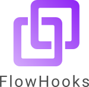
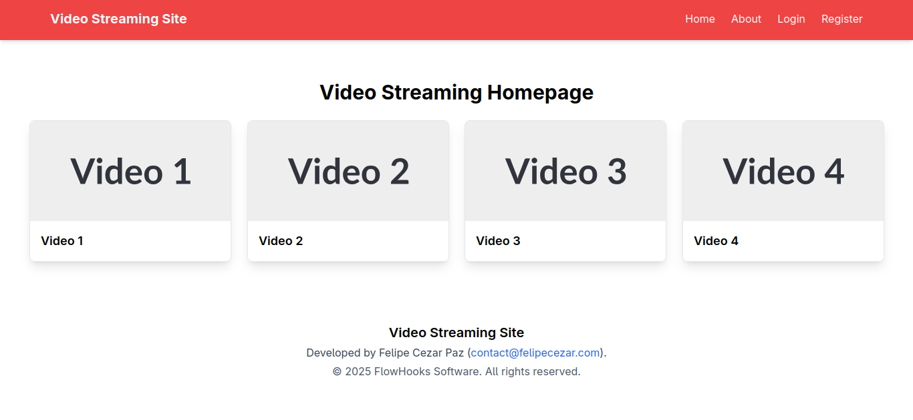

# Video Streaming Website

{: style="float: right; width: 150px;"} 

A full-stack video streaming platform built with React, Vite, Node.js, Express, and MongoDB (Mongoose). This project provides a seamless video streaming experience with a modern frontend and a robust backend API.



---

## Features

- User authentication and management (can be extended)
- Upload and stream videos
- Browse and search videos
- Responsive design with React + Vite + TypeScript frontend
- RESTful API built with Node.js, Express, and MongoDB (Mongoose)

---

## Project Structure

Video-Streaming-Website/

 ├── client/ # React + Vite + TypeScript frontend
 
 └── server/ # Node.js + Express + Mongoose backend API

## Technologies Used

### Frontend (client)
- React
- Vite
- TypeScript
- Axios (for API calls)
- React Router

### Backend (server)
- Node.js
- Express
- MongoDB with Mongoose
- JWT (optional for authentication)
- Multer (optional for video uploads)

---

## Getting Started

### Prerequisites
- Node.js (v16+ recommended)
- MongoDB (local or cloud instance)

### Installation

1. Clone the repository:
   ```bash
   git clone https://github.com/felipeczpaz/video-streaming-website.git
   cd video-streaming-website
   ```

2. Install dependencies for both client and server:
   ```bash
   cd client
   yarn

   cd ../server
   yarn
   ```

3. Configure environment variables for the server (e.g., .env file):
   ```env
   MONGO_URI=your_mongodb_connection_string
   JWT_SECRET=your_jwt_secret
   PORT=5000
   ```

## Running the Project

### Start Backend Server

   ```bash
   cd server
   yarn run dev
   ```

### Start Frontend Client

   ```bash
   cd client
   yarn run dev
   ```

## Usage

- Access the frontend at `http://localhost:3000` (or the port shown by Vite).
- Use the UI to browse, upload, and stream videos.
- The backend API runs on `http://localhost:5000` (or the port set in .env).

## Contributing

Contributions are welcome! Feel free to open issues or submit pull requests.

## License

This project is licensed under the MIT License - see the LICENSE file for details.

## Contact

For any inquiries or feedback, please reach out to the project maintainer:

- **Name**: Felipe Cezar Paz
- **Email**: contact@felipecezar.com

## Acknowledgements

- React and Vite communities
- Express and Mongoose documentation
- Inspiration from modern video streaming platforms

